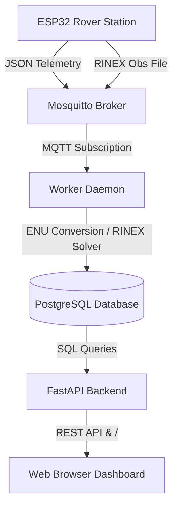

# GNSS Deformation Monitoring System: Master Guide

This document contains a comprehensive walkthrough of the LowCostGNSS ground deformation monitoring prototype, instructions for VPS deployment, and the ESP32 hardware integration guide.

---

## 1. System Walkthrough

This prototype is a containerized, real-time pipeline that collects high-precision GNSS coordinates (via live telemetry or static session files), calculates local ground displacement, and visualizes alerts on a dashboard.

### Data Ingestion Modes

The system supports two distinct workflows for coordinate ingestion:
1. **Real-time Live Telemetry**: Rovers publish periodic JSON coordinate packets directly over MQTT.
2. **Static Session Post-Processing**: Rovers upload standard GNSS observation data (RINEX format) over MQTT at the end of a session for baseline post-processing.

### Data Flow Architecture



### Components Walkthrough

1. **Hardware (ESP32 / ZED-F9P)**: The rover reads high-precision NMEA/UBX data from its GNSS module.
   * **Telemetry Mode**: Once a position fix is achieved, it builds a JSON payload and publishes it to `sigap/<rover-id>/telemetry`.
   * **Static Mode**: Collects raw observations over a scheduled session, generating a RINEX observation file, and uploads the binary payload to `sigap/<rover-id>/rinex`.
2. **MQTT Broker (Eclipse Mosquitto)**: Listens on port `1883` (unencrypted, internal container traffic) and `8883` (TLS encrypted, public hardware traffic). It uses Access Control Lists (ACLs) to restrict rovers:
   * A client authenticated as `<rover-id>` can only publish to `sigap/<rover-id>/telemetry` and `sigap/<rover-id>/rinex`.
3. **Worker Daemon (Python)**: Subscribes to the wildcard topic `sigap/+/telemetry` and `sigap/+/rinex`.
   * **For JSON Telemetry**: Reads incoming coordinates, performs ECEF-to-ENU coordinate transformation relative to the baseline reference coordinates, saves the position, and evaluates geohazard rules.
   * **For RINEX Files**: Saves binary data into `/app/storage/rinex/<rover-id>/`, parses approximate coordinates from the header (with RTK simulation fallback), calculates ENU displacement relative to the reference coordinates, logs the session, and triggers rules.
4. **Rule Engine**: Evaluates geohazard, status, and health rules:
   * **Data Quality Check**: Validates if data is reliable (`fix_type == "RTK_FIX"`, `hdop <= 1.0`, `satellites_active >= 10`). If not met, updates the status to `TIDAK_DAPAT_DINILAI` and triggers a `WASPADA` warning.
   * **Movement Indicators**: Calculates local displacements in millimeters:
     * Horizontal Displacement: $\sqrt{\text{East}^2 + \text{North}^2}$
     * Movement Indicator: $\max(\text{Horizontal}, |\text{Up}|)$
   * **Displacement Rules**: Evaluates the movement indicator if and only if data is reliable:
     * $\ge 50$ mm: Triggers `BAHAYA` geohazard alert.
     * $20 - 50$ mm: Triggers `WASPADA` geohazard alert.
     * $< 20$ mm: Clears movement alerts (status `AMAN`).
   * **Heartbeat Monitor**: Runs every 10 seconds. If no telemetry is received from an active rover within **60 seconds**, the rover status is changed to `OFFLINE` and a `WASPADA` communication alert is generated.
   * **Battery Monitoring**: Evaluates device voltage:
     * $< 10.8$ V: Triggers `BAHAYA` power alert.
     * $10.8 - 11.5$ V: Triggers `WASPADA` power alert.
     * $\ge 11.5$ V: Clears battery alerts.
5. **FastAPI Backend**: Reads data from PostgreSQL, serving REST endpoints (`/api/dashboard`, `/api/history`) and delivering the dashboard UI via the root path `/`.
6. **Frontend Dashboard**: Polls the backend API every **10 seconds**, automatically displaying rover status (connectivity, battery, GNSS quality, displacement trends) and managing real-time alarms.

---

## 2. VPS Deployment & Port Configuration

To deploy this system to a virtual private server (VPS), follow these requirements and settings.

### Minimum VPS Specifications
* **CPU**: 1 vCPU
* **RAM**: 2 GB RAM (with swap memory enabled)
* **OS**: Ubuntu 22.04 LTS / 24.04 LTS

### Port Configuration (Firewall Setup)

Configure your VPS firewall (e.g. UFW or cloud security group) with the following rules:

| Port | Protocol | Traffic | Purpose | Exposure |
|:---:|:---:|:---:|---|---|
| **`80` / `443`** | TCP | Inbound | HTTP/HTTPS dashboard access (if using Nginx reverse proxy) | Public |
| **`8000`** | TCP | Inbound | Direct FastAPI Dashboard & API Port | Public (or reverse-proxied) |
| **`8883`** | TCP | Inbound | Secure TLS MQTT connection for ESP32 hardware | Public |
| **`1883`** | TCP | Inbound | Standard MQTT connection | **Keep Closed** (for safety, or open only for local testing) |
| **`5432`** | TCP | Inbound | PostgreSQL database | **Keep Closed** (Accessible internally only) |
| **`22`** | TCP | Inbound | SSH Access | Restricted to your IP |

### Deployment Steps

#### Step 1: Install Docker and Docker Compose
On your VPS, run:
```bash
sudo apt update && sudo apt install -y docker.io docker-compose-v2
```

#### Step 2: Configure 2GB Swap Memory (Recommended)
On low-cost VPS instances, configure swap to prevent Out-Of-Memory daemon terminations:
```bash
sudo fallocate -l 2G /swapfile
sudo chmod 600 /swapfile
sudo mkswap /swapfile
sudo swapon /swapfile
echo '/swapfile none swap sw 0 0' | sudo tee -a /etc/fstab
```

#### Step 3: Copy Files and Start Containers
Upload your project directory to the VPS and run:
```bash
docker compose up -d
```
Verify all containers are healthy:
```bash
docker compose ps
```

---

## 3. ESP32 Hardware Integration Guide

To send data, you must program your ESP32 to publish to the Mosquitto broker.

### Required Arduino IDE Libraries
* **PubSubClient** (by Nick O'Leary)
* **ArduinoJson** (by Benoit Blanchon)

### Pre-defined Station Logins
The system's Access Control List (ACL) requires the client username to match the topic:

| Rover ID | Username | Password | Allowed Telemetry Topic |
|:---:|:---:|:---:|---|
| **Rover-01** | `rover-01` | `rover01pass` | `sigap/rover-01/telemetry` |
| **Rover-02** | `rover-02` | `rover02pass` | `sigap/rover-02/telemetry` |
| **Rover-03** | `rover-03` | `rover03pass` | `sigap/rover-03/telemetry` |
| **Rover-04** | `rover-04` | `rover04pass` | `sigap/rover-04/telemetry` |
| **Rover-05** | `rover-05` | `rover05pass` | `sigap/rover-05/telemetry` |

---

### Code Template A: Standard (Unencrypted) MQTT — Port 1883
*Best for testing on local Wi-Fi.*

```cpp
#include <WiFi.h>
#include <PubSubClient.h>
#include <ArduinoJson.h>

const char* ssid = "YOUR_WIFI_SSID";
const char* password = "YOUR_WIFI_PASSWORD";

// Server Configuration
const char* mqtt_server = "192.168.1.100"; // Replace with your VPS/Server IP
const int mqtt_port = 1883;

// Station credentials (must match the station ID in the topic)
const char* mqtt_user = "rover-04";
const char* mqtt_pass = "rover04pass";
const char* mqtt_topic = "sigap/rover-04/telemetry";

WiFiClient espClient;
PubSubClient client(espClient);
unsigned long lastMsg = 0;
#define MSG_INTERVAL 15000 // Send data every 15 seconds

void setup_wifi() {
  delay(10);
  Serial.print("\nConnecting to ");
  Serial.println(ssid);
  WiFi.begin(ssid, password);
  while (WiFi.status() != WL_CONNECTED) {
    delay(500);
    Serial.print(".");
  }
  Serial.println("\nWiFi connected");
  Serial.print("IP Address: ");
  Serial.println(WiFi.localIP());
}

void reconnect() {
  while (!client.connected()) {
    Serial.print("Attempting MQTT connection...");
    String clientId = "ESP32Client-";
    clientId += String(random(0xffff), HEX);
    
    if (client.connect(clientId.c_str(), mqtt_user, mqtt_pass)) {
      Serial.println("connected!");
    } else {
      Serial.print("failed, rc=");
      Serial.print(client.state());
      Serial.println(" try again in 5 seconds");
      delay(5000);
    }
  }
}

void setup() {
  Serial.begin(115200);
  setup_wifi();
  client.setServer(mqtt_server, mqtt_port);
}

void loop() {
  if (!client.connected()) {
    reconnect();
  }
  client.loop();

  unsigned long now = millis();
  if (now - lastMsg > MSG_INTERVAL) {
    lastMsg = now;

    // --- READ GEODETICS (MOCK READINGS) ---
    // Replace these values with actual readings from your GNSS receiver (e.g. u-blox)
    double latitude = -6.79100478;
    double longitude = 107.12541100;
    double altitude = 1218.76;
    float battery = 12.15;
    int satellites = 16;
    float hdop = 0.55;
    const char* fix_type = "RTK_FIX"; 

    // Create JSON
    StaticJsonDocument<256> doc;
    doc["latitude"] = latitude;
    doc["longitude"] = longitude;
    doc["altitude_m"] = altitude;
    doc["battery_voltage"] = battery;
    doc["satellites_active"] = satellites;
    doc["hdop"] = hdop;
    doc["fix_type"] = fix_type;

    char buffer[256];
    serializeJson(doc, buffer);

    Serial.print("Publishing: ");
    Serial.println(buffer);
    
    if (client.publish(mqtt_topic, buffer)) {
      Serial.println("Success!");
    } else {
      Serial.println("Failed!");
    }
  }
}
```

---

### Code Template B: Secure TLS (Encrypted) MQTT — Port 8883
*For secure connection using the self-signed Certificate Authority certificate.*

```cpp
#include <WiFi.h>
#include <WiFiClientSecure.h>
#include <PubSubClient.h>
#include <ArduinoJson.h>

const char* ssid = "YOUR_WIFI_SSID";
const char* password = "YOUR_WIFI_PASSWORD";

// Server Configuration
const char* mqtt_server = "your-vps-domain-or-ip.com";
const int mqtt_port = 8883;

const char* mqtt_user = "rover-04";
const char* mqtt_pass = "rover04pass";
const char* mqtt_topic = "sigap/rover-04/telemetry";

// Certificate Authority certificate (from mosquitto/certs/ca.crt)
const char* ca_cert = \
"-----BEGIN CERTIFICATE-----\n" \
"MIIDCTCCAfGgAwIBAgIUcA8EArP/2plATCjyBwKxFZKO7Z4wDQYJKoZIhvcNAQEL\n" \
"BQAwFDESMBAGA1UEAwwJTXlMb2NhbENBMB4XDTI2MDgyMDExMDUzMFoXDTI3MDgy\n" \
"MDExMDUzMFowFDESMBAGA1UEAwwJTXlMb2NhbENBMIIBIjANBgkqhkiG9w0BAQEF\n" \
"AAOCAQ8AMIIBCgKCAQEArpJztOGY47Tv7KTzm6612PTHJNg7rasw6N2kZmKMkRp5\n" \
"MkbfQsGs5JfrsNxr7pG4Zp1RJ5kVMuziqmWUjUcpoyPKbiywnzDP5mMR5qIu+76X\n" \
"kjcCEkdVKuX1gxx5lv8s+mVJnnMc3s/hGKbasxm7rWw+Uzt7j1ADy+dcMWdlVqcc\n" \
"Gurv8JniFEFzgqrPtZHFroxl2KeDQ2VCqomlfp7zanrx5oTth7U6njcDs7nTcQHG\n" \
"6jMfLmKJqQXr3VfO+EUwXTbKjJVkbrErBEOZpotXpYalDkRmkaB8PHP/LkZGnjfK\n" \
"N5mHIn45pfPPcrL9ETeTIFLQdNxZjn7hkM3uV0zIlwIDAQABo1MwUTAdBgNVHQ4E\n" \
"FgQUstcb7fehmgDQ3SslRcHsjjzeQsQwHwYDVR0jBBgwFoAUstcb7fehmgDQ3Ssl\n" \
"RcHsjjzeQsQwDwYDVR0TAQH/BAUwAwEB/zANBgkqhkiG9w0BAQsFAAOCAQEAZM6I\n" \
"sBaG16Rc66b0/h3f3d5nOgOdgEZxie9nsuACVN/9BdHfdzqwLWp3rLvVgcuxK0Z+\n" \
"czJYBA46Uv3DxTVCh8uHV9eSJXU80KVumm4CQscIvask9Q8ufXK+To/c5GtTbrwG\n" \
"KMNoUhlmhDNo9/iJb+9RJfViGgoJnrH4hjrSxIGRlb5gUGc6/tnkA20lw6EMCAxn\n" \
"2SBEg6qLJ/TCK8TeYZTHSD7UWoILHkoq72wgY1SUGYXNss889SbpgvP9XqgwCaLA\n" \
"BnLLrj+1VvGH+NMVa6TrYXzRn7e2PtvZj70KtcTtqYRVPPrCYnDEWhIWjsmNXQrb\n" \
"3ugCv+O0gspm6gPeIw==\n" \
"-----END CERTIFICATE-----\n";

WiFiClientSecure espClient;
PubSubClient client(espClient);
unsigned long lastMsg = 0;
#define MSG_INTERVAL 15000

void setup_wifi() {
  delay(10);
  Serial.print("\nConnecting to ");
  Serial.println(ssid);
  WiFi.begin(ssid, password);
  while (WiFi.status() != WL_CONNECTED) {
    delay(500);
    Serial.print(".");
  }
  Serial.println("\nWiFi connected securely!");
}

void reconnect() {
  while (!client.connected()) {
    Serial.print("Attempting secure MQTT connection...");
    String clientId = "ESP32SecureClient-";
    clientId += String(random(0xffff), HEX);
    
    if (client.connect(clientId.c_str(), mqtt_user, mqtt_pass)) {
      Serial.println("connected securely!");
    } else {
      Serial.print("failed, rc=");
      Serial.print(client.state());
      Serial.println(" try again in 5 seconds");
      delay(5000);
    }
  }
}

void setup() {
  Serial.begin(115200);
  setup_wifi();
  
  // Attach the certificate
  espClient.setCACert(ca_cert);
  
  // NOTE: If connecting via an IP address instead of domain, 
  // you may need to bypass CN validation if the domain name doesn't match:
  // espClient.setInsecure(); // Uncomment this line if connection fails due to certificate CN mismatches
  
  client.setServer(mqtt_server, mqtt_port);
}

void loop() {
  if (!client.connected()) {
    reconnect();
  }
  client.loop();

  unsigned long now = millis();
  if (now - lastMsg > MSG_INTERVAL) {
    lastMsg = now;

    // --- MOCK GNSS READINGS ---
    double latitude = -6.79100478;
    double longitude = 107.12541100;
    double altitude = 1218.76;
    float battery = 12.15;
    int satellites = 16;
    float hdop = 0.55;
    const char* fix_type = "RTK_FIX"; 

    StaticJsonDocument<256> doc;
    doc["latitude"] = latitude;
    doc["longitude"] = longitude;
    doc["altitude_m"] = altitude;
    doc["battery_voltage"] = battery;
    doc["satellites_active"] = satellites;
    doc["hdop"] = hdop;
    doc["fix_type"] = fix_type;

    char buffer[256];
    serializeJson(doc, buffer);

    Serial.print("Publishing Securely: ");
    Serial.println(buffer);
    
    if (client.publish(mqtt_topic, buffer)) {
      Serial.println("Secure publication success!");
    } else {
      Serial.println("Secure publication failed.");
    }
  }
}
```

---

## 4. Administrative API & Security

The FastAPI backend exposes endpoints for administration and simulation. These endpoints are protected by API Key authentication.

### Authentication Header
* **Header Name**: `X-API-Key`
* **Default Value**: `my_super_secret_api_key_123` (configurable via `API_KEY` environment variable in `docker-compose.yml`)

### Administrative Endpoints

| Method | Endpoint | Description | Headers Required |
|:---:|---|---|:---:|
| **`POST`** | `/api/stations` | Creates or updates a station baseline (latitude, longitude, reference height, map position coordinates). | `X-API-Key` |
| **`POST`** | `/api/simulasi-alarm` | Manually triggers a simulated alarm (`WASPADA` or `BAHAYA`) for a specific rover. | `X-API-Key` |
| **`POST`** | `/api/simulasi-clear` | Resolves and clears all active simulated alarms for a specific rover. | `X-API-Key` |

---

## 5. Testing and Validation Utilities

### Single Telemetry Publishing Tool (`send_one.py`)

For rapid testing and pipeline validation, you can use the `send_one.py` script located in the project root directory. This script uses Docker command-line execution to publish a mock telemetry message directly inside the Mosquitto container:

```python
import subprocess

payload = '{"latitude":-6.789123411, "longitude":107.123456880, "altitude_m":1250.413, "battery_voltage":12.4, "satellites_active":16, "hdop":0.5, "fix_type":"RTK_FIX"}'

subprocess.run([
    'docker', 'exec', '-i', 'gnss_mosquitto', 
    'mosquitto_pub', 
    '-u', 'worker', 
    '-P', 'workerpass', 
    '-t', 'sigap/rover-01/telemetry', 
    '-m', payload
])
print("Telemetry published successfully!")
```

### Manual Command-Line MQTT Publishing

If you prefer testing directly in the terminal, run the following command to simulate a telemetry packet:

```bash
docker exec -i gnss_mosquitto mosquitto_pub -u worker -P workerpass -t sigap/rover-01/telemetry -m '{"latitude":-6.789123411, "longitude":107.123456880, "altitude_m":1250.413, "battery_voltage":12.4, "satellites_active":16, "hdop":0.5, "fix_type":"RTK_FIX"}'
```
